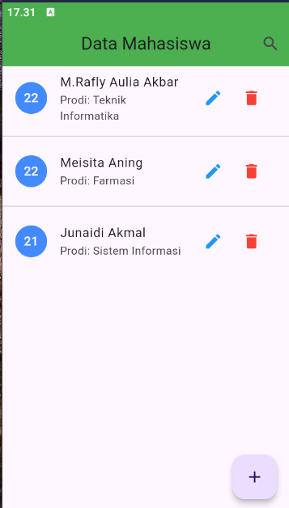
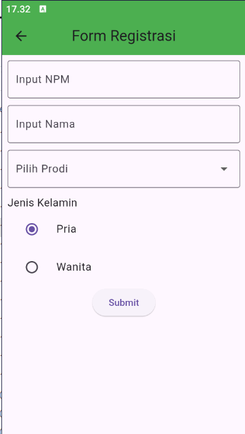
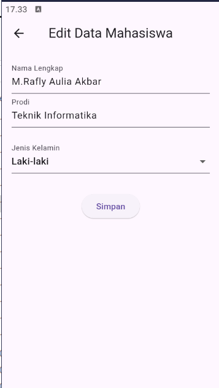
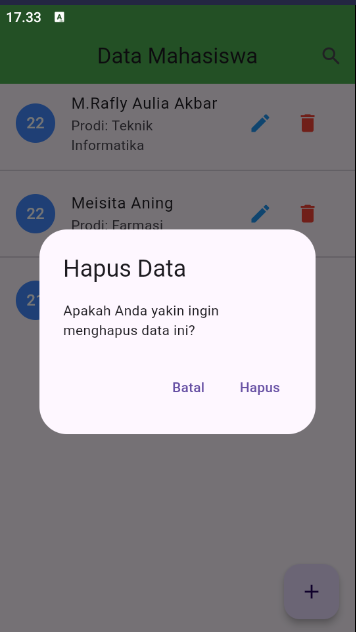

# 📚 Aplikasi Registrasi Mahasiswa


Aplikasi **Registrasi Mahasiswa** adalah aplikasi sederhana berbasis Flutter yang memiliki fitur **CRUD** (Create, Read, Update, Delete). Aplikasi ini memudahkan pengguna dalam **menambah, mengedit, menghapus**, dan **menampilkan** data mahasiswa.

---

## 🎨 Tampilan Aplikasi

### 🏠 Beranda (Home)



### ➕ Tambah Data



### ✏️ Edit Data



### ❌ Hapus Data



---

## ⚖️ Fitur Utama

- **🏠 Beranda:** Menampilkan daftar mahasiswa.
- **➕ Tambah Data:** Menambahkan data mahasiswa baru.
- **✏️ Edit Data:** Mengedit informasi data mahasiswa.
- **❌ Hapus Data:** Menghapus data mahasiswa dari daftar.

---

## 🛠 Teknologi yang Digunakan

- **Flutter**: Framework untuk membangun antarmuka pengguna yang responsif.
- **Dart**: Bahasa pemrograman utama untuk Flutter.
- **SQLite**: Penyimpanan lokal untuk menyimpan data mahasiswa.

---

## 🛡 Instalasi

1. **Clone Repository**

   ```bash
   git clone https://github.com/username/repository-name.git
   cd repository-name
   ```

2. **Install Dependencies**

   ```bash
   flutter pub get
   ```

3. **Jalankan Proyek**
   ```bash
   flutter run
   ```

---

## 🔧 Struktur Folder

```
projek03_registrasi/
│
├── lib/
│   ├── main.dart          # Entry point aplikasi
│   ├── mahasiswa.dart     # Model mahasiswa
│   ├── dbhelper.dart      # Database helper (SQLite)
│   ├── register.dart      # Halaman tambah data
│   ├── edit.dart          # Halaman edit data
│   ├── detailData.dart    # Halaman detail data
│
├── images/                # Folder gambar
│   ├── home.png           # Gambar tampilan Home
│   ├── tambah_data.png    # Gambar tampilan Tambah Data
│   ├── edit_data.png      # Gambar tampilan Edit Data
│   ├── hapus_data.png     # Gambar tampilan Hapus Data
│
└── README.md
```
## © Lisensi

Proyek ini menggunakan lisensi **MIT**. Silakan gunakan, modifikasi, dan bagikan dengan bebas.

---

## ✨ Kontribusi

Kontribusi sangat diharapkan! Ikuti langkah berikut untuk berkontribusi:

1. **Fork** repository ini.
2. Buat **branch** baru untuk fitur atau perbaikan Anda.
   ```bash
   git checkout -b feature-anda
   ```
3. **Commit** perubahan Anda.
   ```bash
   git commit -m "Menambahkan fitur ..."
   ```
4. **Push** ke GitHub.
   ```bash
   git push origin feature-anda
   ```
5. Buat **Pull Request**.

---

**❤️ Terima kasih telah menggunakan Aplikasi Registrasi Mahasiswa ini!**
